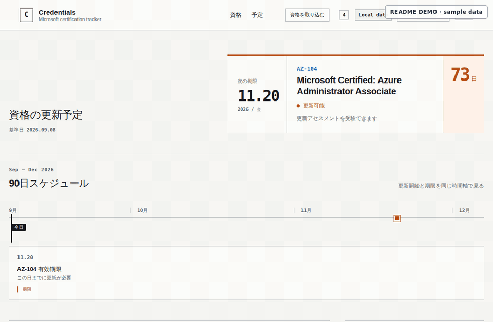

# Microsoft Credentials Tracker

A personal web app for tracking Microsoft credential renewal windows, expiry dates, and the next action that needs attention.

**[Open Microsoft Credentials Tracker](https://credentials.shimabell.dev)**



> The overview uses deterministic sample data. It is not live Microsoft account data.

The main view is intentionally date-led: it shows the credential that needs attention first, then the 90-day renewal/expiry schedule, followed by the full credential register. Transcript import and Google Calendar synchronization stay under the compact **Data and integrations** entry instead of occupying permanent dashboard space.

## How to use

1. Sign in to Microsoft Learn and open your [Transcript](https://learn.microsoft.com/users/me/transcript).
2. Select **Print**, then save the transcript as a PDF from your browser's print dialog.
3. Open [credentials.shimabell.dev](https://credentials.shimabell.dev).
4. Select the saved Transcript PDF and review the credentials detected by the app.
5. Confirm the credentials you want to keep. The app then derives renewal windows, expiry status, and upcoming deadlines.
6. Optionally connect Google Calendar and explicitly synchronize renewal and expiry events.

The app is designed around the Microsoft Learn Transcript PDF rather than a Microsoft account/API integration.

## Privacy and data handling

- Transcript PDFs are parsed locally in your browser with PDF.js. They are not uploaded to an application backend.
- Confirmed credential facts are stored in versioned browser-local storage on the device/browser you are using.
- The app currently has no application backend, server-side database, or Microsoft account authentication.
- Google Calendar synchronization happens only when you explicitly start it. OAuth access tokens are kept in memory rather than persisted by the app.

Clearing browser storage or switching browsers/devices will therefore remove or isolate the locally stored credential state.

## Features

- attention-first current state for expired, renewable, and upcoming credentials
- proportional 90-day schedule for renewal openings and expiry deadlines
- full credential register with desktop and mobile layouts
- Microsoft Learn Transcript PDF import and review before saving
- renewal-window, expiry, and non-expiring status projection
- explicit one-way synchronization to a dedicated Google Calendar
- responsive browser UI suitable for desktop and mobile use

## Development

```bash
npm ci
npm run dev
```

Quality checks:

```bash
npm run check
npm run typecheck
npm run test
npm run build
npm run test:e2e
```

## Documentation

- [Product scope](PRODUCT.md)
- [Design contract](DESIGN.md)
- [Architecture](docs/ARCHITECTURE.md)
- [Credential domain model](docs/DOMAIN.md)
- [Google Calendar integration](docs/GOOGLE_CALENDAR.md)
- [Deployment and operations](docs/DEPLOYMENT.md)
- [Fixed Staging slot](docs/STAGING.md)
- [Foundation provenance](docs/FOUNDATION.md)

## License

Released under the [MIT License](LICENSE).

This is an independent open-source project and is not affiliated with, endorsed by, or sponsored by Microsoft.
