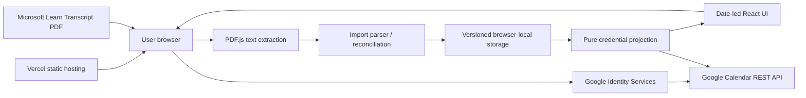

# Runtime architecture

This document describes the architecture that is implemented today. It is not a target-state design for a future backend.

## System boundary

Microsoft Credentials Tracker is a browser-first React + TypeScript + Vite single-page application hosted on Vercel.

The current runtime has no application API, server-side database, Microsoft account login, or background worker. Credential facts remain in the user's browser after explicit confirmation.



## Runtime components

### React + TypeScript + Vite

The application is a client-side SPA. Vite builds the static frontend bundle and Vercel serves the resulting application.

The SPA is deliberately kept on the existing React/Vite stack. Hosting choices do not justify changing the application framework.

### Transcript input

The supported assisted-input path is a Microsoft Learn Transcript saved by the user as a PDF.

The selected PDF is processed locally:

1. PDF.js extracts text in the browser.
2. The parser converts supported external records into import candidates.
3. Candidates are reconciled against the application-owned credential catalog.
4. The user reviews the result.
5. Only explicitly confirmed, matched records become application data.

The PDF itself is not uploaded to an application backend or persisted by the application.

See [DOMAIN.md](DOMAIN.md) for the domain and import contract.

### Browser-local persistence

Confirmed credential facts are stored in a versioned browser-local envelope. This is the current MVP source of truth after user confirmation.

The storage adapter is intentionally separate from transcript parsing and credential projection so a future API-backed persistence implementation can replace the browser storage boundary without rewriting the domain model.

Browser-local persistence implies important operational behavior:

- data is scoped to the browser profile/device;
- clearing site data can remove locally confirmed application data and Google Calendar integration metadata;
- the current app does not provide server-side backup or multi-device synchronization.

### Pure credential projection

The application stores facts and derives time-dependent UI state from those facts and credential policy.

Examples of derived values include:

- active / renewal-available / expired / non-expiring status;
- renewal opening date;
- days until expiry;
- next credential deadline;
- 90-day schedule events;
- current-month markers and upcoming events.

These derived values are not persisted as independent application facts.

### Google Calendar integration

Google Calendar synchronization is an explicit browser action, not an application login mechanism or background process.

The browser uses Google Identity Services to obtain an access token with the application-created-calendar scope. The token remains in memory and is used directly with the Google Calendar REST API.

The application creates or reuses its dedicated secondary calendar and reconciles only events it owns. Google-side changes are not synchronized back into credential facts.

See [GOOGLE_CALENDAR.md](GOOGLE_CALENDAR.md) for the authorization, ownership, reminder, and failure contracts.

## Trust and data-flow boundaries

| Boundary | Current behavior |
| --- | --- |
| Transcript PDF | User-supplied external input; parsed conservatively in the browser |
| Microsoft Learn data | Assisted input only; never silently overwrites confirmed application facts |
| Credential catalog | Application-owned definitions and policy |
| Confirmed credential facts | Browser-local application source of truth for the MVP |
| Derived schedule/status | Recomputed from confirmed facts and policy |
| Google access token | Browser memory only; not persisted |
| Google Calendar | External projection target; not a credential source of truth |
| Vercel | Hosts the static SPA; does not hold application credential data |

## Not present in the current architecture

The following are deliberately not implemented and must not be described as current behavior:

- Microsoft / Entra authentication;
- Microsoft Graph credential synchronization;
- an application backend or API;
- a server-side database;
- refresh-token storage;
- automatic or background credential synchronization;
- server-side Transcript PDF processing;
- multi-user or organization/tenant ownership.

## Future replacement seam

If server-side persistence is introduced later, the preferred seam is the storage boundary:

```text
Transcript / manual input
        |
        v
normalization + domain logic
        |
        v
storage adapter
   |          |
current      future
localStorage API/database
```

The domain model and projection functions should remain independent of whether persistence is browser-local or server-backed.
